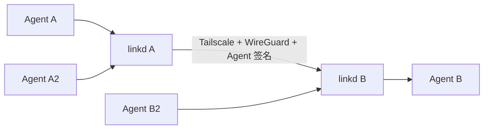

## 背景

Tailscale 提供节点可达性与 WireGuard 加密，但同一 Tailnet 内的设备身份不足以区分同一主机上的多个 Agent，也不表达 Agent 之间的双向通信授权。

## 目标 / 非目标

**目标：**

- 建立完全对等的通用 A2A 通信层。
- 以 Tailscale 节点、linkd Agent 身份和 per-Agent capability 形成分层信任。
- 以双方独立确认的 Agent 白名单作为最终消息准入。
- 在无中心邮箱条件下提供发送方持久 outbox 和幂等投递。
- 让 Codex 仅作为可替换适配器接入。

**非目标：**

- 不实现远程控制、远程 TUI 或替代 Agent 自身权限系统。
- 不实现 OpenVPN、公网裸 A2A 或第三方云消息中继。
- 控制面使用自托管 Headscale，不把 Cloudflare 当作控制面或 Agent 数据面。

## 设计决策

- 守护进程只做身份、准入、路由、可靠投递和审计，不决定任务执行权限。
- Tailscale 网络校验拆为地址策略与 LocalAPI `WhoIs` 两层：监听地址必须属于 Tailscale CGNAT/ULA 地址段，入站连接必须能解析为预期 Headscale Tailnet 节点身份。
- 不自建主机 mTLS、私有 CA、客户端证书或主机证书指纹；节点上下文由 Tailscale Local API `WhoIs` 和配对确认的 Stable Node ID 提供。
- Agent ID 由版本化的 Ed25519 公钥摘要派生；每 Agent 另有独立 capability keypair，challenge 后换取短期 session capability。
- Agent 准入按 Contact 状态、Stable Node ID、Agent 公钥、RFC 9421/9530 签名、时间窗、nonce 和 capability 顺序校验；任何一步失败都只写脱敏审计元数据。
- 外部请求和响应都使用 detached HTTP Message Signature；A2A JSON 保持官方结构，不包自定义 envelope。
- 目标 Endpoint 只能通过 linkd 专属 Unix Socket/Named Pipe 或 linkd-issued ingress token 访问；裸 loopback HTTP 请求必须拒绝。
- 传输 nonce 防重放与 A2A `messageId` 幂等分别持久化，避免把连接级重放和任务级重复投递混为同一语义。
- 每个 Agent 的私钥和联系人状态独立存储。
- 正式消息必须通过 Agent 签名验证、联系人 `active` 检查和幂等检查。
- A2A SDK 类型作为协议边界，内部持久化使用稳定的项目模型，避免 transport 绑定。
- 业务系统不依赖 Cloudflare、官方 Tailscale SaaS 或官方 DERP。

## 风险 / 权衡

- 无中心 mailbox 意味着发送端也离线时无法继续投递。
- Standard profile 信任宿主 OS 账号，不承诺抵抗同一 OS 用户的任意恶意代码；Strong profile 使用独立 OS principal 或容器。
- 纯 Go SQLite 和跨平台 IPC 降低安装依赖，但需要分别验证 Unix 与 Windows 行为。
- Codex Hook 和 app-server 接口可能演进，适配器必须保持版本探测和失败封闭。
