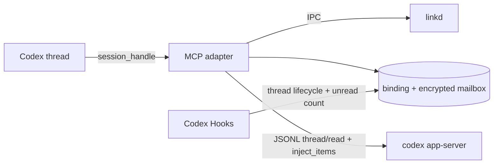

# 背景

Codex app-server 通过 stdio JSONL 提供 JSON-RPC 风格请求、响应和通知；请求需在连接级 `initialize` / `initialized` 握手后发送。A2A context 生命周期长于任一 Codex thread，因此 thread 只作为可替换的展示和执行容器。

# 目标 / 非目标

**目标：**

- 提供可测试的 app-server JSONL 客户端与完整 thread 读取。
- 用 adapter 私有 SQLite 保存绑定和 mailbox，并对正文做认证加密。
- 通过签名 session handle 把 MCP 调用绑定到明确 Codex thread。
- 使用 Codex 官方插件、MCP 与 Hook 入口自动装配。

**非目标：**

- 不修改 Codex TUI、IDE 或 Desktop。
- 不从 Hook transcript 解析隐藏推理或其他 thread 内容。
- 不让 linkd 替目标 Codex 决定工具、文件、Shell 或联网授权。

# 设计决策

- app-server 客户端使用后台 reader 按 `id` 分发响应，通知进入独立队列。
- active binding 与 binding history 分表/分状态保存；重新 attach 不覆盖历史。
- 出站消息的 `threadSync` metadata 首次携带过滤后的可见 turn 快照，后续以最近 turn 为基线携带增量；隐藏推理、system/developer 内容永不跨 Agent 传递。
- mailbox 使用独立本地密钥、随机 nonce、AES-256-CTR 与 HMAC-SHA256 Encrypt-then-MAC；数据库不得出现明文正文。
- linkd 在已完成 Agent 准入后将入站 A2A 正文按 source/target/messageId 加密写入本机 mailbox，并只通过 capability 保护的本地 IPC 提供给适配器。
- Hook 从 stdin 读取官方 JSON schema。SessionStart/UserPromptSubmit 只生成 session handle 与未读提示，外部正文只在用户调用 inbox attach 后作为 user message 注入。
- Adapter 先调用 `thread/read(includeTurns=true)`；新 app-server 进程遇到 `thread not loaded` 时执行 `thread/resume` 后重读。已加载但尚未产生首个 user turn 的 Thread 允许直接 `thread/inject_items`；并发隔离不依赖“最近活动 thread”。

# 风险 / 权衡

- app-server schema 随 Codex 版本演进：doctor 与错误信息必须提示版本不兼容，测试锁定当前稳定字段。
- mailbox 密钥丢失后正文不可恢复：密钥必须与 adapter SQLite 一起备份，不能静默生成新密钥解密旧库。
- 插件 Hook 仍需用户在 Codex 中审阅信任；这是 Codex 安全边界，不通过绕过参数规避。
