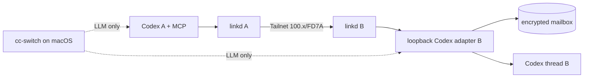

## 架构

每个 E2E 容器包含 `tini`、`tailscaled`、`snw-agent-linkd`、Codex CLI 和 Codex adapter。tailscaled 使用 kernel TUN、独立 state 和 LocalAPI socket；linkd 只绑定运行时发现的 Tailscale 地址。容器 bridge 仅承载控制面和 cc-switch 出站访问，业务 A2A 请求必须命中 100.x/FD7A 地址。

## 关键契约

- linkd 启动时必须连接 tailscaled LocalAPI；WhoIs provider 缺失或失败时，正式网关拒绝启动或拒绝请求。
- adapter relay 使用由 registration secret 派生的短时 HMAC capability，绑定 source、target、context、message、method、generation、过期时间和 nonce；adapter 持久化 nonce 防重放。
- gateway 转发到 loopback adapter 时显式保留已通过 Tailnet/白名单校验的 `X-SNW-Agent-ID`，防止标准 A2A transport 丢失来源身份。
- 同一 A2A context 复用 active Codex thread，不同 context 永久隔离；thread 删除后重建并保留 binding history。
- 入站正文只作为不可信 user item 注入，不得成为 system/developer 指令。
- `agent ensure`/pairing runner 只走 CLI/IPC API，不直接修改 SQLite。

## 运行与证据

- Compose 不发布 7443 到宿主机；healthcheck 通过容器内 Tailnet 地址执行。
- cc-switch 使用 `http://host.docker.internal:15721/v1`、`responses`、固定测试模型，并通过 proxy request log trace 验证真实路由。
- runner 对 A→B、B→A、A→C、C→A、B→C、C→B 保存 Codex tool event、message/task/receipt、source/target/context 和对端 mailbox/thread 绑定。
- 额外 Agent X 保持未配对并验证 Tailnet 可达但 403；合法 Agent 签名从错误节点发出时验证 WhoIs 拒绝；所有负测要求 mailbox 零副作用。
