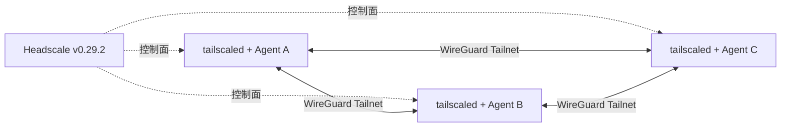

## 架构

## 控制面

- Headscale 使用 SQLite WAL 和持久化 volume。
- 本地 E2E 的 `server_url` 为 Compose 内部地址，不发布公网端口。
- runner 在节点启动前创建 `snw-agents` 用户及三个短期、单次 preauth key。
- preauth key 仅写入 runner 私有临时目录并作为 Docker secret 挂载。
- Headscale 禁用官方 DERP map、更新检查和 logtail，避免运行时依赖 Tailscale SaaS。

## 数据面

- 节点使用官方开源 Tailscale 客户端镜像。
- `tailscale up` 必须显式指定 `--login-server=$HEADSCALE_URL`。
- A2A 网关仍只绑定 Tailscale `100.x`/`fd7a:` 地址。
- Docker bridge 仅用于 Headscale 控制面和 cc-switch；A2A 请求必须命中 Tailnet 地址。

## 生产部署

- `deploy/self-hosted-control-plane/` 在公网 Linux 主机启动 Headscale embedded DERP。
- Headscale 使用 ACME 自动 TLS，公网开放 80/TCP、443/TCP 和 3478/UDP。
- `deploy.sh issue-key` 为每个节点生成一小时有效、不可复用的 preauth key。
- `scripts/join-self-hosted-tailnet.sh` 强制 HTTPS 自建 login-server，并验证节点进入 Running/Online。
- 严格全开源模式下不得配置官方 `controlplane.tailscale.com` DERP map、官方登录服务或 Cloudflare Tunnel。
